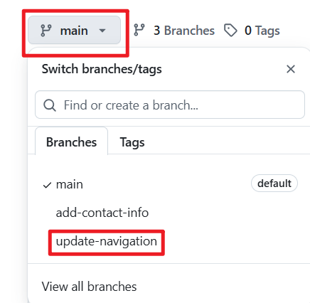

# **Mini Project - Git Branching and Merging**
---

**Part 3: Merging Changes**

After both Tom and Jerry have pushed their changes, other team member can review and merge these changes into the main project. The process involves

1. Creating a **Pull Request**.

2. Merging the Pull Request into the **main** branch.

**Understanding Pull Requests:**

**A Pull Request (PR)** is a feature used in GitHub (and other Git-based version control systems) that allows you to notify team members about the changes you have pushed to a branch in a repository. Essentially, it is a request to review and pull in your contribution to the main project. Pull requests are central to the collaborative development process, enabling team members to discuss, review, and make further changes before changes are merged.

**How to Create a Pull Request on GitHub**

After both Tom and Jerry have pushed their work to their respective branches, the next step is to create a pull request for each of them. Here is how Tom would create a pull request for his changes.

1. **Navigate to Your GitHub Repository:**

* Open your web browser and go to the GitHub page for the repository.

2. **Switch to the Branch:**

* Click on the branch dropdown menu near the top-left corner of the file and select the branch Tom that you have been working on ("update-navigation".)

3. **Compare & Pull Request:**

* Click on the compare & pull request as shown below;

4. **Review Tom's Changes:**

* Before creating the pull request, Tom would review his changes to ensure everything is correct. GitHub shows the differences between the base branch and and Tom's branch. It's a good opportunity for Tom to double-check his work.

5. **Create the Pull Request:**

* If everything looks good, click the **"Create pull request"** button. 

* Provide a title and description for the pull request. The title should be concise and descriptive, and the description should explain the change that the pull request is about, why it's needed, and any other relevant details.

* After filling in the information, click **"Create pull request" button.

**Reviewing and Merging Tom's Pull Request**

Once the pull request is created, it becomes visible to other team members who can review the changes, leave comments, and request additional modifications if necessary (this is an example of what collaboration is about in DevOps). When the team agrees that the changes are ready and good to go, someone with merge permissions can merge the pull request, incorporating the changes from Tom's **update-navigation** branch into the main branch.

Following the same process, Jerry would create a pull request for his **add-contact-info** branch after Tom's changes have been merged, ensuring that the project stays up to date and conflicts are minimized.

**Updating Jerry's Branch with Latest Changes**

Before Jerry merges his changes into the main branch, it's essential to ensure his branch is up-to-date with the main branch. This is because other changes (like Tom's updates) might have been merged into the main branch after Jerry started working on his feature. Updating ensures compatibility and reduces the chances of conflicts.

**Steps to Update Jerry's Branch:**

* On the terminal, Switch to Jerry's branch using the command:
 
  ``git checkout add-contact-info``

* Pull the latest changes from the main branch using the command:
 
  ``git pull origin main``

 Purpose: This command fetches the changes from the **main** branch and merges them into Jerry's **add-contact-info** branch. It ensures that any updates made to the main branch, like Tom's merged changes, are now included in Jerry's branch. This step is crucial for avoiding conflicts and ensuring that Jerry's work can smoothly integrate with the main project.

* Merge the pull request to the main branch: Click the **"Merge pull request"** button to merge Tom's changes into the **main** branch. This action combines Tom's contributions with the rest of the project, completing the collaborative workflow.

**Finalizing Jerry's Contribution**

Assuming there are no conflicts, Jerry's branch is now ready to be merged back into the main project.

* Push the updated branch to GitHub by using the command: 
 
  ``git push origin add-contact-info``

This command uploads Jerry's changes to GitHub. Now, his branch reflects both his work and the latest updates from the main branch.

The **origin** keyboard in the command refers to the default name Git gives to the remote repository from which you cloned your project.

* Create the Pull Request (PR) for Jerry's changes, similar to how you did for Tom.

* Merge Jerry's Pull Request: Click on **"Confirm merge"** to complete the process of merging the PR into the main branch.

This simulated workflow illustrates how Git facilitates collaborative development, allowing multiple developers to work simultaneously on different aspects of a project and merge their contributions seamlessly , even when working on the same files.

