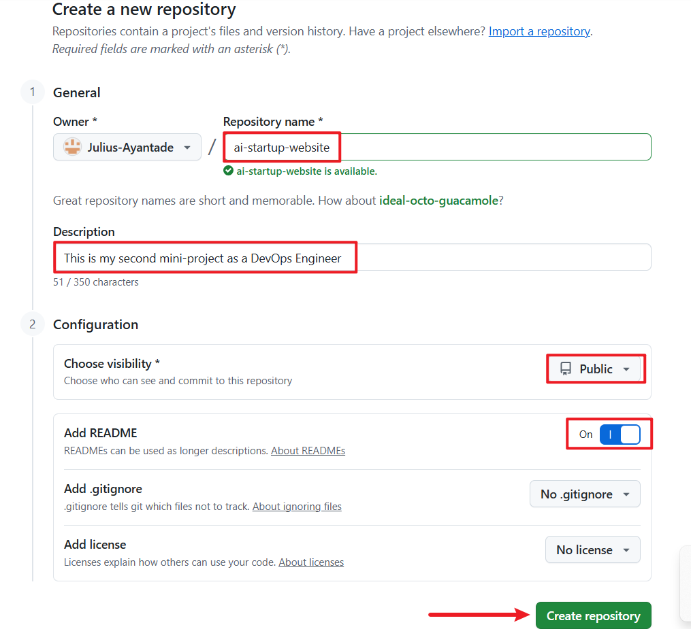

# **Mini Project - Basic Git Commands**
---
# Hands-On Git Project: Collaborative Website Development with Git and GitHub

This is a step-by-step project to simulate the workflow of Tom and Jerry using Git and GitHub. This hands-on project include installation of Git, setting up a GitHub repository, cloning the repository, creating branches, making changes, and merging those changes back into the main branch.

**Part 1: Setup and Initial Configuration**

1. **Install Git:**

* Both Tom and Jerry have Git downloaded and installed on their computers by logging in to https://git-scm.com and follow the installation process.

  

2. **Create a GitHub Repository**

* Login to GitHub.

* Click the "+" icon in the top-right corner and select "New repository."

* Name your repository (**"ai-startup-website"**) and initialize it with a README file.

* Click "Create repository."
  

3. **Clone the Repository**

* Click the **"Code"** button and copy the HTTPS URL.
  
 

* Open your terminal or command prompt.

* Create a folder named **"git-project**" in the folder where you are storing all **DAREY.IO** related work.

* Change directory into the **"git-project"**.
  
* Clone (Download) the repository from GitHub using the command: 

  ``git clone [Past the URL copied from GitHub]``

* Since you just cloned your repository, your branch is **``main``**

* Navigate into the repository you cloned using the command: 

  ``cd ai-startup-website``

* Create an empty file **"index.html"**
  
* Add the content below
  
  ``This is the Admin creating an index.html file for Tom and Jerry.``

* Check changes has not been staged using the command: 
  
  ``git status``
  
* Stage changes using the command: 
 
  ``git add index.html``

* Confirm changes have been staged for commit: 
  
  ``git status``

* After staging the changes, the file name will appear in **green** in the terminal output. The colour change signifies that the file has been successfully staged, making it ready for the next step, which is committing these changes to the project's history.

* Commit changes using the command: 
  
  ``git commit -m "This is my first commit"``

* This takes the staged changes and record them in the repository's history with a message describing what was done . This commit is a milestone, making a specific point in the project's development.

* Push main branch to GitHub using the command: 
  
  ``git push origin main``

  This sends commits from your main branch on your laptop to GitHub (Remote Repository).

**Part 2: Simulating Tom and Jerry's Work**

To simulate both Tom and Jerry working on the same laptop, you'll switch between two branches, making changes as each character.
  

1. **Tom's Work:**
   
* Navigate to the project directory you just cloned using the command: 

  ``cd ai-startup-website``

  This moves you into the folder containing the cloned GitHub repository on your local machine.

* Check the current branch: This shows you a list of all branches in your local repository. Initially, you'll see only the **`"main"`** branch because that's the default starting point and no other branches have been created yet.

  ``git branch``

* Create a new branch for Tom's work using the command: 
  
  ``git checkout -b update-navigation``

  This creates a new branch name **"update-navigation"**. The command also automatically switches to the newly created branch from the **"main"** branch. This branch **"update-navigaton"** is where you'll simulate Tom's updates to the website without affecting whatever is in the **main** branch.

* Check the branch again to see your newly created branch using the command: 
  
  ``git branch``

Running ``git branch`` again now shows your newly created branch, indicating you're now working in this new **"workspace"** dedicated to Tom's navigation updates.

* Recall you created an empty file **"index.html"** in the main. The file will also exist in the **"update-navigation"**. Open the **"index.html"** and add the content below.

``This is Tom adding Navigation to the AI-website``

This stimulates Tom's contribution to the project. This text represents the work he's doing on the navigation bar. In the real world, this will be an actual software code.

* Check changes has not been stages using the command: ``git status``

At this stage, Tom has modified the file but these changes have not been prepared for a commit in Git. This is indicated by the file name appearing in **red** in the terminal output, signaling that the changes are recognized by Git but not yet staged.

* Stage Tom's changes using the command: 
  
  ``git add index.html``
  
This tells Git you want to include the updates made to **index.html** in the next commit. 

* Confirm changes have been staged for commit using the command: 
  
  ``git status``

  Now, after staging the changes, the file name will appear in **green** in the terminal output. This colour change signifies that the file has been successfully staged, making it ready for the next step, which is committing these changes to the project's history.

* Commit Tom's changes using the command: 

  ``git commit -m "Update navigation bar"``

  This takes the staged changes and record them in the repository's history with a message describing what was done. This commit is a milestone, marking a specific point in the project's development.

* Push Toms branch to GitHub using the command: 
  
  ``git push origin update-navigation``

  This sends Tom's commits from your local branch on your laptop to GitHub (Remote Repository). It is like publishing your work so that others (in this case, "Jerry") can see and interact with it. This step updates the remote repository with Tom's contributions.

After completing Tom's workflow, you will now simulate Jerry's contribution to the project. To do this, you will

* switch back to the main branch,
  
* create a new branch for Jerry,
  
* make changes, and then
  
* stage, commit, and push these changes to GitHub.

2. **Jerry's Work:**

* Switch back to the main branch using the command: 
  
  ``git checkout main``
  
This command switches your current working directory back to the **main** branch, ensuring that Jerry's changes start from the latest version of the project.

* Pull the latest changes using the command: 
  
  ``git pull origin update-navigation``

This ensures that you have the latest updates from the repository.

* Create a new branch for Jerry's Work using the command: 
  
  ``git checkout -b add-contact-info``

This creates a new branch where Jerry will make his changes, keeping them separate from the **main** project until they are ready to be merged.

* open **index.html** and add contact information: Make your changes to the **index.html** file by adding contact information. This simulates Jerry's task.

* Stage Jerry's changes using the command: 
  
  ``git add index.html``

* This command stages the changes Jerry made to the **index.html** file, preparing them for commit.

* Commit Jerry's changes using the command: 
  
  ``git commit -m "Add contact information"``

This saves Jerry's changes in the branch's history, with a message describing what was done.

* Push Jerry's branch to GitHub using the command: 
  
  ``git push origin add-contact-info``

This command uploads Jerry's branch to the GitHub repository, making it available for review and merging into the main project.

