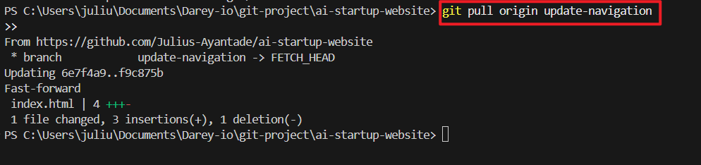

# **Mini Project - Git Version Control Basics**
---

A Version Control System (VSC) is a vital tool in software development. It is designed to track and manage changes to code or documents over time. VSC enables multiple developers to collaborate on the same project efficiently, by controlling and merging changes made by different team members.

**Introducing Git: A Leading Version Control System**

Git is a tool that helps people work together on computer projects, like building a website. Git keeps track of all the changes everyone makes, so if something goes wrong, you can always go back to a version that worked. It also allow everyone work on their parts at the same time without getting in each other's way.

**Conceptualising Git Set Up with Tom and Jerry**

1. **Initial Setup:**

* Both Tom and Jerry have Git installed on their computers.
  

  
* They clone the project repository from a central repository (GitHub) to their local machines. This gives each of them a complete copy of the project, including all its files and version history.
  

2. **Tom and Jerry start working**

* Tom and Jerry pull the latest changes from the central repository to ensure they start with the most current version of the **index.html** file.
  
 

* They both create a new branch from the main project. A branch in Git allows developers to work on a copy of the codebase without affecting the main line of development. Tom names his branch **update-navigation**, and Jerry names his **add-contact-info**.

3. **Making changes:**
  
* On this branch, Tom updates the navigation bar in **index.html**.
  
* Simultaneously, Jerry works on his branch to add contact information to the footer of the same file.
  
* They commit their changes to their respective branches. A commit in Git is like saving your work with a note about what you've done.

  

4. **Merging changes:**
   
* Once they're done, Tom and Jerry push their branches to the central repository.

* Tom decides to merge his changes first. He creates a **pull request (PR)** for his branch **update-navigation**. A PR is a way to tell the team that he's done and his code is ready to be reviewed and merged into the main project.

  

* After reviewing Tom's changes, the team merges his PR into the main branch, updating the **index.html** file on the main project line.
  
* Jerry then updates his branch with the latest changes from the main project to include Tom's updates. This steps is crucial to ensure that Jerry is working with and integrating his changes into the most current version of the project.
  
* Jerry resolves any conflicts that arise from Tom's changes and his own. Git provides tools and commands to help identify and resolve these conflicts.
  
* Jerry then pushes his updated branch and creates a PR for his changes. The team reviews jerry's additions, and once they're approved, his changes are merged into the main project.

**Conclusion**

Through this process, Tom and Jerry were able to work on the same file simultaneously without overwriting each other's work. Git tracked their changes, allowing them to merge their updates seamlessly into the main project. This project illustrates the power of using a VCS like Git for collaborative development, ensuring that all contributions are preserved and integrated efficiently and effectively.
